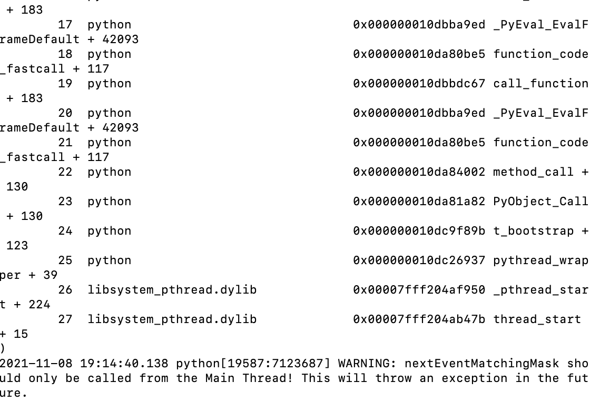

# Online Conferencing Framework
[TOC]
## Overview
This framework provides a possible way to implement the online meeting project.It is **not the only way** to implement the project. **If you want to code by your own, then you can just ignore this framework.**  

There are **three parts** of the framework, i.e., the **Client**, the **Server** and others. You can **refer to these files for more details**.

### Client part

- `client_sockets.py`: The base class of client sockets is provided in this file. 
  - You can create **different sub classes** based on this base class
  - Or you can complete this super class as **the only client sockets**.
- `client.py`: This is **the main client file**. You should **run this file as a client**. A **simple CLI** is provided in this file.
  - You can **implement the** **GUI** and totally ignore the code of the CLI part.
  - Or you can **modify the CLI** as you like based on the provided code.

### Server part

- `server_sockets.py`: An example server socket class which is a threading class is provided.
  - You can define **different server sockets** 
  - Or you can use this example server as the **only server sockets**

- `server.py`: This is **the main server file**. You should **run this file as a server**. A **multi-threading framework** is provided in this file.
  - You can implement **concurrency** based on the provided **multi-threading framework**
  - Or you can use **other ways** to implement concurrency
  - You should also **complete the** **Meeting** **class** in this file
    - The **Meeting class** should contain information of **active meetings, the members of each meeting and so on**

### Other files

- `CONSTANTS.py`: **Define constants only** in this file. You should import this python file in other python files if you want to use the constants in this file.

## Project Implementation Tips
1. You can either use **one socket** in both client and server, or **multiple sockets** for different types of messages.
2. If you use **multiple sockets** in the client, you need to **map** these sockets to the one client in the server so that you can deal with message from the same client conveniently.
   - One easy way to do so: **Bind the port of clients**. For example, the base port is `xxx` and next port is `xxx+1`... In this way, if the server receives information from the port `xxx+1`, we can know that its base port is `xxx`.
3. You can implement the feature of **concurrency** with different methods:
   - Processing
   - Threading
   - Coroutine
   - IO multiplexing

## Possible Bugs or Warnings
1. If you are using the **Mac OS**, it would throw a warning when you try to **use GUI (e.g., opencv) in a threading** and hence you might not be able to see the GUI like this:

   

2. If you are using the package `struct` among different OS (for example, the Mac OS and Windows), **some formats might have different sizes.** For example:

  ```python
  # windows
  >>> a = struct.calcsize('L')
  >>> a
  4
  # macbook
  >>> a = struct.calcsize('L')
  >>> a
  8
  ```

  So you need to be careful about it.

3. When you try to run this project https://www.lanqiao.cn/courses/672, you might directly lose the video connection. Please check if you can open the camera via **opencv**: `self.cap.isOpened()`. If you can not open the camera, please firstly check your camera. If it works, then please reinstall the opencv.

4. Please use `conda` to install the `pyaudio` package.

